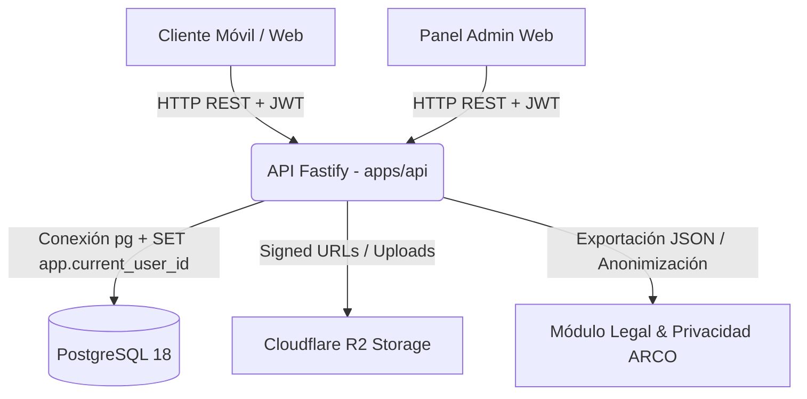

# Arquitectura del Sistema - Contractor Pro

Este documento describe la arquitectura global, patrones de diseño y decisiones tecnológicas de **Contractor Pro**, una plataforma monorepo orientada a la industria de la construcción en Panamá.

---

## 1. Visión General y Monorepo

Contractor Pro utiliza un enfoque de **Monorepo npm** (`workspaces`), centralizando la API backend, el panel de administración web y la aplicación móvil cliente/contratista en un mismo repositorio.

```
CONTRACTOR-APP/
├── apps/
│   ├── api/          # Backend REST (Node.js 22, Fastify, TypeScript)
│   ├── admin-web/    # Panel web administrativo (React 19, Vite, TypeScript)
│   └── mobile/       # Aplicación móvil/web contratistas (Expo 52, React Native, Expo Router)
├── database/
│   ├── migrations/   # 19+ migraciones SQL estructuradas por orden correlativo
│   ├── seeds/        # Catálogo oficial (Contraloría / precios de referencia Panamá)
│   └── scripts/      # Scripts de control de esquemas, bootstrap, baseline, checksums y despliegue
└── docs/             # Especificaciones técnicas, privacidad, retención y guías operativas
```

---

## 2. Tecnologías Principales

| Capa | Tecnología | Descripción |
| :--- | :--- | :--- |
| **Backend API** | Node.js 22 + Fastify | API REST de alto rendimiento con TypeScript, Fastify CORS, Rate-Limit y Cookie Cifrada |
| **Base de Datos** | PostgreSQL 18 | Motor de base de datos relacional con RLS, triggers y funciones almacenadas |
| **Panel Admin** | Vite + React 19 + TypeScript | SPA para administración, catálogo global, auditoría y privacidad ARCO |
| **Cliente Móvil / Web** | Expo 52 + React Native + Expo Router | Aplicación multiplataforma (iOS, Android, Web) |
| **Almacenamiento** | Cloudflare R2 / Storage | Almacenamiento privado de adjuntos y fotos con URLs firmadas |
| **Despliegue Web** | Cloudflare Pages | Hosting estático/SPA para `admin-web` y `mobile-web` |
| **Despliegue API** | Render / Web Service | Alojamiento administrado para la API Fastify |

---

## 3. Arquitectura Backend (`apps/api`)

La API sigue un patrón modular basado en servicios y repositorios.

### 3.1 Módulos de Dominio
- `auth`: Autenticación por JWT, refresco de token y cookies HTTP-only.
- `account` / `legal`: Módulo de exportación de datos (`GET /account/export`), eliminación y anonimización de cuenta (`DELETE /account`), y distribución pública de Términos (`GET /legal/terms`) y Política de Privacidad (`GET /legal/privacy`).
- `budgets`, `invoices`, `projects`, `clients`, `companies`, `catalog`, `storage`, `notifications`: Módulos operacionales core.

### 3.2 Seguridad y Privacidad ARCO
1. **Encabezados de Seguridad**: HSTS, CSP, X-Content-Type-Options, Referrer-Policy y Permissions-Policy configurados en cada respuesta Fastify.
2. **Control de Acceso Contextual (RLS)**: Cada transacción SQL establece `app.current_user_id()`.
3. **Eliminación y Depuración**: La solicitud `DELETE /account` anonimiza datos personales en PostgreSQL y programa la eliminación física de adjuntos en 30 días según la Política de Retención.

---

## 4. Arquitectura de Base de Datos (`database/`)

- `app_auth`: Perfiles (`profiles`), credenciales y tokens de refresco.
- `app_commercial`: Empresas, invitaciones, proyectos, presupuestos, facturas, comprobantes, fotos y catálogo Panamá.
- `app_migrations`: Registro auditado de migraciones (`schema_migrations`) con checksums SHA-256 inmutables.

---

## 5. Diagrama de Arquitectura Integrada


